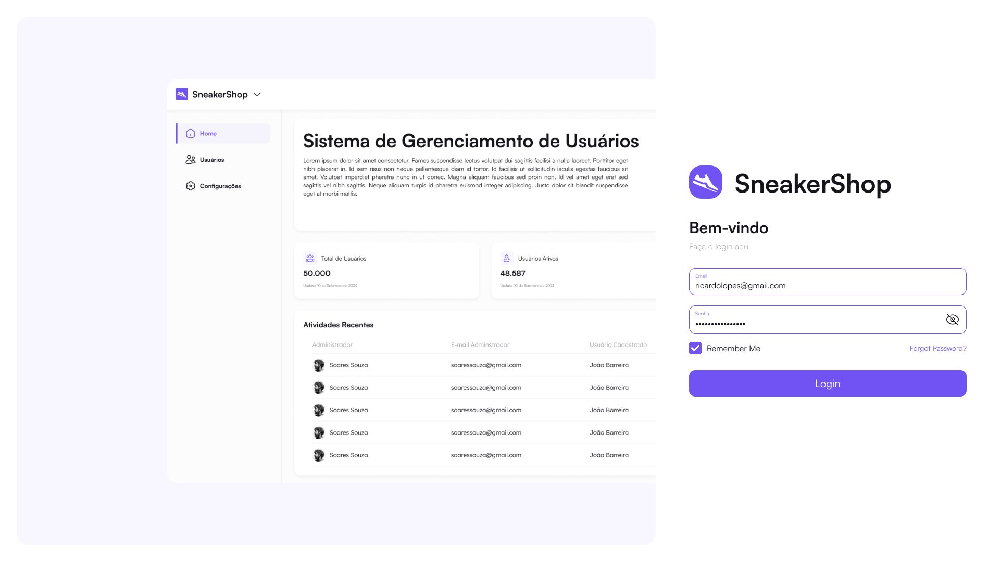
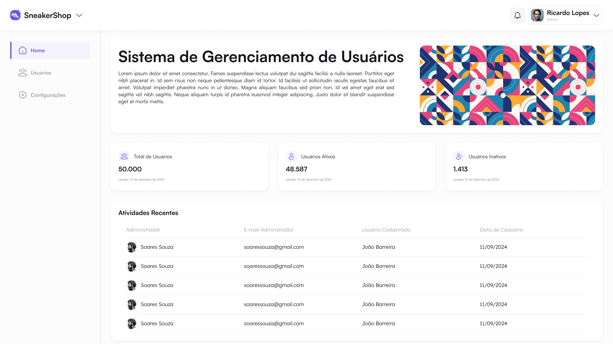
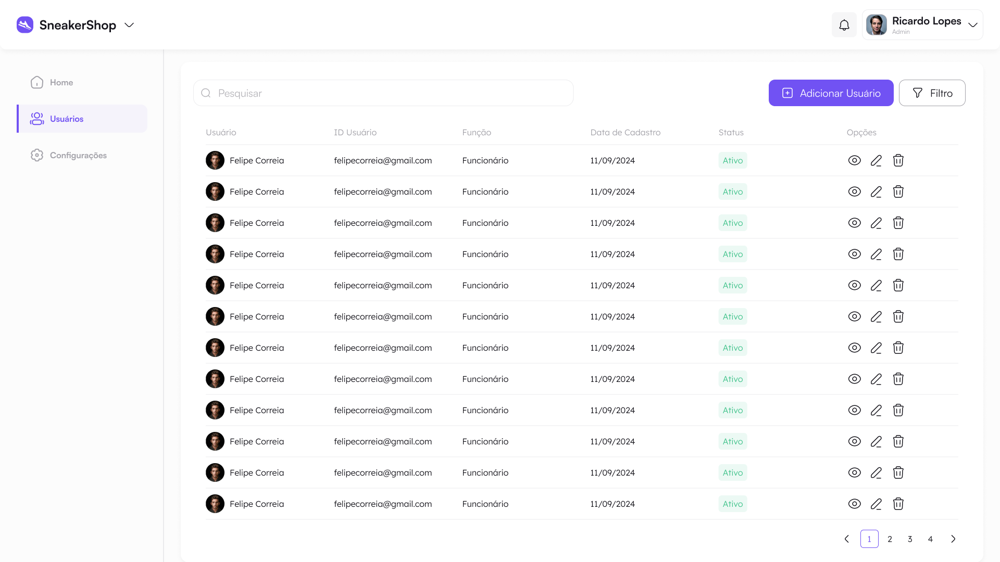
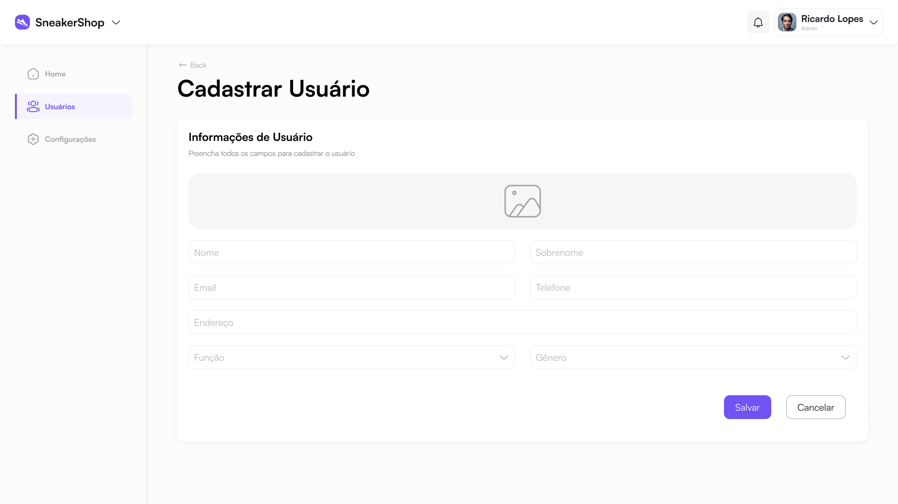

## Sistema de Gerenciamento de Usuários - Loja SneakerShop

Documentação do **Sistema de Gerenciamento de Usuários** para a loja **SneakerShop**. O sistema foi desenvolvido, visando proporcionar uma interface intuitiva e funcional para os administradores da loja, facilitando a gestão de usuários de forma eficiente.

#### Objetivo

O objetivo principal desta sistema é oferecer uma solução simples e eficaz para os administradores do SneakerShop monitorarem e gerenciarem os perfis de usuários, incluindo funcionalidades como:

- Criação, edição e remoção de contas de usuários
- Visualização de histórico de operações recentes
- Visualização de todos os usuários cadastrados

#### Principais Telas do Design

1. **Login**: Página para acesso dos administradores no sistema.

   

2. **Home**: Exibe um resumo das funcionalidades do sistema, informações básicas de total de usuários e informações das operações recentes dos feitas pelos administradores.

   

3. **Lista de Usuários**: Uma tela onde os administradores podem visualizar e pesquisar usuários. A lista inclui informações básicas como nome, e-mail, status da conta e ações rápidas para editar ou remover contas.

   

4. **Cadastro/Edição de Usuário**: Interface para cadastrar ou modificar os dados dos usuários, como nome, e-mail, permissões e status. Esta tela foi desenhada para ser clara e direta, reduzindo a complexidade de gerenciamento.

   


Para mais detalhes, acesse o [projeto no Figma](https://www.figma.com/design/SJuZt1hepNeWCXbaC9Ls9p/Gerenciamento-de-Usu%C3%A1rios---SneakerShop?node-id=3019-2807&t=JGKBrdmabTsH7u8N-1).

---

## Instalar dependências

#### Pacote @svgr/webpack

```npm install @svgr/webpack --save-dev```

## Execução

Primeiro, execute o servidor de desenvolvimento:

```bash
npm run dev
# ou
yarn dev
# ou
pnpm dev
```

Abra [http://localhost:3000](http://localhost:3000) no seu navegador para ver o resultado.


